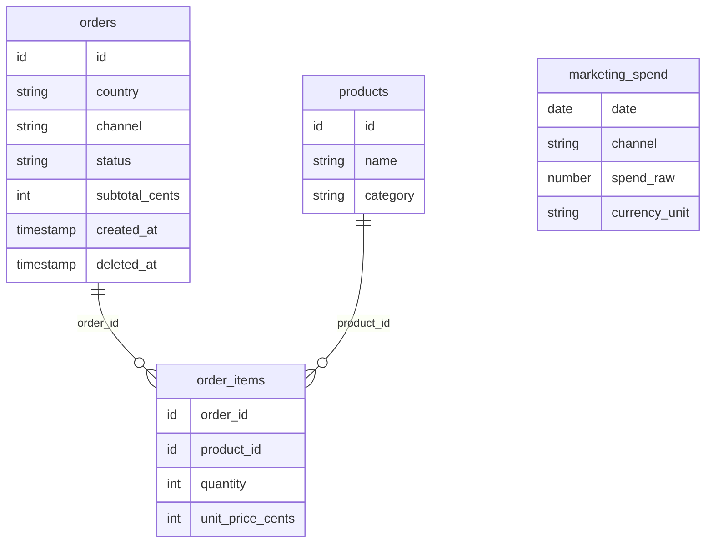

## 1. Perfil por país: el ticket medio de España es un 30 % menor que el de Alemania (60,44 € frente a 86,79 €), con más pedidos y casi las mismas ventas

**Qué dice el dato.** España suma 20.610,07 € de ventas (49,3 %), 341 pedidos (58,3 %) y 111 clientes, con un ticket medio de 60,44 €. Alemania suma 21.176,06 € (50,7 %), 244 pedidos (41,7 %) y 37 clientes, con un ticket medio de 86,79 €. El ticket de España es un 30,4 % menor.

**Por qué importa.** El negocio depende de dos mercados con perfiles distintos.

- **España:** hay tráfico (58 % de los pedidos) pero cada pedido vale poco. Si el ticket subiera 5 € en los 341 pedidos, serían unos 1.700 € al semestre; es un techo, porque supone que todos los pedidos suben.
- **Alemania:** el foco puede estar en captar clientes, porque cada cliente alemán aporta 572 € frente a 186 € en España (unas 3,1 veces más). Hoy el mercado se sostiene con solo 37 clientes. No hay datos de márgenes, así que hablo de valor por cliente y no de beneficio.

**Cómo lo he calculado.** Filas: los 585 pedidos analizables (enero a junio de 2026, `delivered` y `pending`, sin dados de baja y con subtotal de al menos 1 €; el detalle está en *Modelado de datos*). Ventas = `subtotal_cents`, sin IVA ni envío.

Medidas, por país:

- Ventas = suma de `subtotal_cents` entre 100, en euros.
- Pedidos = recuento de pedidos (una fila de `orders` es un pedido). Clientes = `customer_id` distintos.
- Ticket medio = ventas / pedidos (20.610,07 / 341 = 60,44 € en España).
- Ventas por cliente = ventas / clientes (21.176,06 / 37 = 572,33 € en Alemania).
- % de ventas y % de pedidos = lo que suma cada país sobre el total de los dos.
- Diferencia de ticket = ticket de España / ticket de Alemania − 1 (−30,4 %).

```sql
with pedidos as (
  select id, country, customer_id, subtotal_cents
  from orders
  where created_at >= '2026-01-01' and created_at < '2026-07-01'
    and status in ('delivered', 'pending')
    and deleted_at is null
    and subtotal_cents >= 100
),
por_pais as (
  select country as pais,
         count(*) as pedidos,
         count(distinct customer_id) as clientes,
         sum(subtotal_cents) / 100.0 as ventas,
         avg(subtotal_cents) / 100.0 as ticket_medio
  from pedidos
  group by country
)
select pais,
       round(ventas, 2) as ventas_eur,
       round(100.0 * ventas / sum(ventas) over (), 1) as pct_ventas,
       pedidos,
       round(100.0 * pedidos / sum(pedidos) over (), 1) as pct_pedidos,
       clientes,
       round(ventas / clientes, 2) as ventas_por_cliente_eur,
       round(ticket_medio, 2) as ticket_medio_eur,
       round((ticket_medio / max(ticket_medio) filter (where pais = 'DE') over () - 1) * 100, 1) as dif_ticket_vs_alemania_pct
from por_pais
order by pais;
```

---

## 2. Repetición por país: en España cada cliente hace 3,1 pedidos frente a 6,6 en Alemania, aunque repiten casi igual (70 % frente a 68 %)

**Qué dice el dato.** España tiene 111 clientes con 341 pedidos (3,07 por cliente) y 78 de ellos (70,3 %) repiten. Alemania tiene 37 clientes con 244 pedidos (6,59 por cliente) y 25 (67,6 %) repiten. Repiten en la misma proporción, pero los alemanes compran más del doble de veces.

**Por qué importa.** La diferencia no está en que el cliente español repita, sino en que repita más veces. La acción es una promoción de fidelización a partir del 2.º o 3.er pedido. Alemania, además, depende de 37 clientes: perder a unos pocos pesa mucho.

**Cómo lo he calculado.** Filas: los mismos 585 pedidos analizables. Cliente = `customer_id` distinto con pedidos analizables en ese país. Repite = 2 o más pedidos en el semestre.

Medidas:

- Primero cuento los pedidos de cada cliente dentro de cada país (una fila por cliente y país).
- Clientes = número de clientes distintos de cada país. Pedidos = suma de los pedidos de esos clientes.
- Pedidos por cliente = pedidos / clientes (341 / 111 = 3,07 en España; 244 / 37 = 6,59 en Alemania).
- Clientes que repiten = clientes con 2 o más pedidos. % que repiten = clientes que repiten / clientes (78 / 111 = 70,3 %; 25 / 37 = 67,6 %).

```sql
with pedidos as (
  select id, country, customer_id, subtotal_cents
  from orders
  where created_at >= '2026-01-01' and created_at < '2026-07-01'
    and status in ('delivered', 'pending')
    and deleted_at is null
    and subtotal_cents >= 100
),
por_cliente as (
  select country, customer_id, count(*) as pedidos
  from pedidos
  group by country, customer_id
)
select country as pais,
       count(*) as clientes,
       sum(pedidos) as pedidos,
       round(sum(pedidos) * 1.0 / count(*), 2) as pedidos_por_cliente,
       count(*) filter (where pedidos >= 2) as clientes_que_repiten,
       round(100.0 * count(*) filter (where pedidos >= 2) / count(*), 1) as pct_clientes_que_repiten
from por_cliente
group by country
order by country;
```

---

## 3. Meta absorbe el 54 % del gasto de marketing (1.534 €) y devuelve 3,7 € de venta por cada euro gastado, mientras que email y TikTok juntos reciben el 19 % (539 €) y devuelven 14,1 €

**Qué dice el dato.** Del 15 de marzo al 30 de junio se gastaron 2.855 € en publicidad. Meta se lleva 1.533,58 € (53,7 %) y se atribuye el 22,5 % de las ventas (5.645,21 €, 69 pedidos): por cada euro gastado vende 3,68 € (ventas atribuidas / gasto, lo que llamo ROAS en adelante) y gasta 22,23 € por pedido. Google gasta el 27,4 % y devuelve un ROAS de 4,84 (13,27 € por pedido). Email y TikTok juntos gastan el 18,9 % (538,61 €), se atribuyen el 30,2 % de las ventas (7.578,21 €) y tienen un ROAS de 14,07 (4,94 € por pedido).

**Por qué importa.** El presupuesto está concentrado en el canal que menos devuelve por euro, y el que mejor devuelve recibe menos de una quinta parte. La acción es mover una parte del gasto de Meta y Google hacia email y TikTok con una prueba limitada (del orden de 100 a 120 €/mes), parando si el retorno cae. Cautelas:

- El ROAS es medio, no marginal: con poco gasto, como en TikTok, no tiene por qué mantenerse al subirlo.
- Es retorno en ventas, no beneficio, porque no hay márgenes.
- El gasto no viene por país, así que no se sabe a quién va dirigido.

**Cómo lo he calculado.** Filas: los pedidos analizables creados del 15 de marzo al 30 de junio (350) y el gasto diario de ese mismo tramo (540 filas, 108 días por 5 canales, una vez quitado un duplicado). Los canales se limpian como se explica en *Modelado de datos*: las variantes de Meta e "Instagram Ads" cuentan como Meta Ads y "Newsletter" como Email.

Medidas, por canal:

- Ventas atribuidas = suma de `subtotal_cents` de los pedidos del canal, en euros. Pedidos = recuento de pedidos del canal.
- Gasto = suma del gasto diario del canal en la ventana, en euros.
- ROAS = ventas atribuidas / gasto (euros de venta por cada euro de gasto).
- Gasto por pedido = gasto / pedidos (Meta: 1.533,58 / 69 = 22,23 €).
- % del gasto y % de las ventas = el del canal sobre el total de todos los canales. Email + TikTok es la suma de los dos. Direct y Organic no tienen gasto, así que no tienen ROAS.

```sql
with pedidos as (
  select id, country, channel, subtotal_cents
  from orders
  where created_at >= '2026-03-15' and created_at < '2026-07-01'
    and status in ('delivered', 'pending')
    and deleted_at is null
    and subtotal_cents >= 100
),
ventas_canal as (
  select case when lower(trim(channel)) like '%meta%' or trim(channel) = 'Instagram Ads' then 'Meta Ads'
              when trim(channel) = 'Newsletter' then 'Email'
              else trim(channel) end as canal,
         count(*) as pedidos,
         sum(subtotal_cents) / 100.0 as ventas
  from pedidos
  group by case when lower(trim(channel)) like '%meta%' or trim(channel) = 'Instagram Ads' then 'Meta Ads'
                when trim(channel) = 'Newsletter' then 'Email'
                else trim(channel) end
),
gasto_canal as (
  select case when lower(trim(channel)) like '%meta%' or trim(channel) = 'Instagram Ads' then 'Meta Ads'
              else trim(channel) end as canal,
         sum(case when currency_unit = 'EUR_CENTS' then spend_raw / 100.0 else spend_raw end) as gasto
  from (
    select distinct on (date, channel) date, channel, spend_raw, currency_unit
    from marketing_spend
    where date >= '2026-03-15' and date <= '2026-06-30'
    order by date, channel, id
  ) sin_duplicados
  group by case when lower(trim(channel)) like '%meta%' or trim(channel) = 'Instagram Ads' then 'Meta Ads'
                else trim(channel) end
),
por_canal as (
  select v.canal, g.gasto, v.ventas, v.pedidos
  from ventas_canal v
  left join gasto_canal g on g.canal = v.canal
),
totales as (
  select sum(gasto) as gasto_total, sum(ventas) as ventas_total from por_canal
),
resumen as (
  select canal, gasto, ventas, pedidos from por_canal
  union all
  select 'Email + TikTok Ads', sum(gasto), sum(ventas), sum(pedidos)
  from por_canal where canal in ('Email', 'TikTok Ads')
)
select r.canal,
       round(r.gasto, 2) as gasto_eur,
       round(100.0 * r.gasto / t.gasto_total, 1) as pct_del_gasto,
       round(r.ventas, 2) as ventas_netas_eur,
       round(100.0 * r.ventas / t.ventas_total, 1) as pct_de_las_ventas,
       r.pedidos,
       round(r.ventas / r.gasto, 2) as roas,
       round(r.gasto / r.pedidos, 2) as gasto_por_pedido_eur
from resumen r
cross join totales t
order by r.gasto desc nulls last, r.canal;
```

---

## 4. El 90 % de las ventas atribuidas a Meta son alemanas: Meta aporta el 38 % de las ventas de Alemania y solo el 4,7 % de las de España

**Qué dice el dato.** De los 5.645,21 € atribuidos a Meta, 5.089,97 € (90,2 %) son de Alemania y 555,24 € (9,8 %) de España. Meta es el 38,4 % de las ventas alemanas y el 4,7 % de las españolas. España vende sobre todo por Organic (36,7 %) y Email (26,0 %), que suman el 62,7 %, frente al 26,9 % de Alemania (10,8 % y 16,1 %).

**Por qué importa.** Los dos países funcionan con canales distintos y el gasto de Meta no viene por país. Si se reparte donde vende, recortar Meta afectaría sobre todo a Alemania; si una parte relevante va a España, donde Meta casi no vende, ahí hay dinero mal usado. Antes de recortar Meta a fondo hay que pedir el gasto por país y, mientras tanto, limitar el recorte. En España, el email es el segundo canal por peso y el vehículo natural para la promoción de fidelización.

**Cómo lo he calculado.** Filas: las mismas que en la conclusión 3 (pedidos analizables del 15 de marzo al 30 de junio, con los canales limpios). No uso `marketing_spend`, porque el gasto no tiene país y no se puede calcular un ROAS por país. El Email de España incluye sus pedidos de newsletter.

Medidas, por canal y país:

- Ventas = suma de `subtotal_cents` de los pedidos del canal en ese país, en euros.
- % de las ventas del país = ventas del canal en el país / ventas totales de ese país (Meta en Alemania: 38,4 %).
- % de las ventas del canal = ventas del canal en el país / ventas totales de ese canal (Meta en Alemania: 90,2 %).

```sql
with pedidos as (
  select id, country, channel, subtotal_cents
  from orders
  where created_at >= '2026-03-15' and created_at < '2026-07-01'
    and status in ('delivered', 'pending')
    and deleted_at is null
    and subtotal_cents >= 100
),
ventas_canal_pais as (
  select case when lower(trim(channel)) like '%meta%' or trim(channel) = 'Instagram Ads' then 'Meta Ads'
              when trim(channel) = 'Newsletter' then 'Email'
              else trim(channel) end as canal,
         country as pais,
         sum(subtotal_cents) / 100.0 as ventas
  from pedidos
  group by case when lower(trim(channel)) like '%meta%' or trim(channel) = 'Instagram Ads' then 'Meta Ads'
                when trim(channel) = 'Newsletter' then 'Email'
                else trim(channel) end,
           country
)
select canal,
       pais,
       round(ventas, 2) as ventas_netas_eur,
       round(100.0 * ventas / sum(ventas) over (partition by pais), 1) as pct_de_las_ventas_del_pais,
       round(100.0 * ventas / sum(ventas) over (partition by canal), 1) as pct_de_las_ventas_del_canal
from ventas_canal_pais
order by canal, pais;
```

---

## 5. El top 5 son 3 prendas de Ropa, unas zapatillas y el Bolso Bandolera, y suma el 39 % de las ventas con 5 de 23 productos; los tres más caros son los que menos unidades venden (8 a 11, el 6,3 % de las ventas) y casi solo en Alemania

**Qué dice el dato.** El top 5 es el Bolso Bandolera (3.846,15 €), la Sudadera (3.452,00 €), el Vestido Midi (3.351,95 €), el Pantalón Cargo (3.012,32 €) y las Zapatillas Running (2.658,10 €): 16.320,52 € (39,1 % de las ventas). Los tres productos de mayor precio medio de venta (Chaqueta Bomber a 89,95 €, Mocasines a 87,96 € y Botas Chelsea a 84,96 €) son los de menos unidades del catálogo: 11, 11 y 8, que suman 2.636,69 € (6,3 %). La Chaqueta y los Mocasines se venden solo en Alemania y las Botas, 7 de 8 unidades en Alemania.

**Por qué importa.** Saber qué productos tiran de las ventas y cuáles no sirve para decidir dónde poner el esfuerzo. Cinco productos hacen el 39 % de las ventas, y son los que ya demuestran demanda en los dos países: ahí es donde las campañas tienen más probabilidades de vender. Los tres que menos se venden (Chaqueta Bomber, Mocasines y Botas Chelsea) se venden casi solo en Alemania y con poco volumen, así que no hay base en los datos para dedicarles presupuesto de campaña ni para llevarlos a España.

**Cómo lo he calculado.** Filas: las líneas de los 585 pedidos analizables que tienen ficha en `products` (se excluyen 16 líneas sin ficha). Los productos inactivos se mantienen y "Sudadera con Capucha" y "Sudadera Capucha" cuentan como un solo producto (ver *Modelado de datos*).

Medidas, por producto:

- Importe de línea = cantidad × `unit_price_cents` / 100.
- Ventas = suma de los importes de línea del producto. Unidades = suma de las cantidades, y por país (España y Alemania).
- Precio medio de venta = ventas / unidades.
- % de las ventas y % acumulado = ventas del producto sobre el total de 41.786,13 €, y suma acumulada en orden de ventas.
- Rankings = por ventas, por precio medio de venta y por menos unidades.

```sql
with pedidos as (
  select id, country, subtotal_cents, created_at
  from orders
  where created_at >= '2026-01-01' and created_at < '2026-07-01'
    and status in ('delivered', 'pending')
    and deleted_at is null
    and subtotal_cents >= 100
),
lineas as (
  select oi.order_id,
         replace(p.name, 'Sudadera con Capucha', 'Sudadera Capucha') as producto,
         p.category as categoria,
         o.country as pais,
         o.created_at,
         oi.quantity,
         oi.quantity * oi.unit_price_cents / 100.0 as importe
  from order_items oi
  join pedidos o on o.id = oi.order_id
  join products p on p.id = oi.product_id
),
por_producto as (
  select producto,
         max(categoria) as categoria,
         sum(importe) as ventas,
         sum(quantity) as unidades,
         coalesce(sum(quantity) filter (where pais = 'ES'), 0) as unidades_es,
         coalesce(sum(quantity) filter (where pais = 'DE'), 0) as unidades_de
  from lineas
  group by producto
)
select producto,
       categoria,
       round(ventas, 2) as ventas_eur,
       round(100.0 * ventas / sum(ventas) over (), 1) as pct_ventas,
       round(100.0 * sum(ventas) over (order by ventas desc) / sum(ventas) over (), 1) as pct_ventas_acumulado,
       unidades,
       unidades_es,
       unidades_de,
       round(ventas / unidades, 2) as precio_medio_venta_eur,
       rank() over (order by ventas desc) as ranking_ventas,
       rank() over (order by ventas / unidades desc) as ranking_precio,
       rank() over (order by unidades asc) as ranking_menos_unidades
from por_producto
order by ventas desc;
```

---

## 6. Calzado y Deporte crecen en Alemania (+24 % y de 206 € a 671 €) y retroceden en España (−8,5 % y de 668 € a 560 €), donde son las dos categorías de menor peso (16 % y 6 %)

**Qué dice el dato.** En Alemania, Calzado pasa de 2.540,18 € en el primer trimestre a 3.158,75 € en el segundo (+24,4 %) y supone el 26,9 % de sus ventas. En España baja de 1.713,51 € a 1.568,65 € (−8,5 %) y pesa un 15,9 %. Deporte, con datos solo desde mayo, pasa en Alemania de 205,60 € en mayo a 671,00 € en junio (4,1 % de las ventas); en España baja de 668,00 € a 560,10 € (6,0 %).

**Por qué importa.** Calzado y Deporte tienen tirón en Alemania, pero en España no despegan y pesan poco: ahí está el margen de crecimiento. Hay que empujar el calzado en España, por ejemplo con campañas por email, y vigilar Deporte con cautela, porque solo tiene dos meses de datos y la tendencia puede ser ruido.

**Cómo lo he calculado.** Filas: las mismas líneas que en la conclusión 5. La categoría es la de la ficha del producto. T1 es enero–marzo y T2 es abril–junio. Deporte solo tiene ventas desde mayo, así que solo se compara mayo con junio.

Medidas:

- Importe de línea = cantidad × `unit_price_cents` / 100, agregado por país y categoría (el país sale de `orders`).
- Variación = ventas T2 / ventas T1 − 1. Peso = porcentaje sobre las ventas del país.

```sql
with pedidos as (
  select id, country, created_at
  from orders
  where created_at >= '2026-01-01' and created_at < '2026-07-01'
    and status in ('delivered', 'pending')
    and deleted_at is null
    and subtotal_cents >= 100
),
lineas as (
  select o.country as pais,
         p.category as categoria,
         extract(month from o.created_at) as mes,
         oi.quantity * oi.unit_price_cents / 100.0 as importe
  from order_items oi
  join pedidos o on o.id = oi.order_id
  join products p on p.id = oi.product_id
),
por_categoria as (
  select pais,
         categoria,
         sum(importe) as ventas,
         sum(importe) filter (where mes <= 3) as ventas_t1,
         sum(importe) filter (where mes >= 4) as ventas_t2,
         sum(importe) filter (where mes = 5) as ventas_mayo,
         sum(importe) filter (where mes = 6) as ventas_junio
  from lineas
  group by pais, categoria
)
select pais,
       categoria,
       round(ventas, 2) as ventas_eur,
       round(100.0 * ventas / sum(ventas) over (partition by pais), 1) as pct_ventas_pais,
       round(ventas_t1, 2) as ventas_t1_eur,
       round(ventas_t2, 2) as ventas_t2_eur,
       round((ventas_t2 / nullif(ventas_t1, 0) - 1) * 100, 1) as var_t2_vs_t1_pct,
       round(ventas_mayo, 2) as ventas_mayo_eur,
       round(ventas_junio, 2) as ventas_junio_eur
from por_categoria
order by pais, ventas desc;
```

---

---

## Modelado de datos

### Tablas y claves



- `orders` basta para país, cliente (`customer_id`), canal y ventas: un pedido es una fila.
- `order_items` y `products` solo se usan en producto y categoría (conclusiones 5 y 6): `orders.id = order_items.order_id` y `order_items.product_id = products.id`, con cruce interno.
- `marketing_spend` no tiene clave común con `orders` ni país: se resume por canal y se une por el nombre del canal ya limpiado (conclusión 3).
- No se usa la vista `v_kpis_mensuales` ni `order_promotions`: la vista cuenta cada promoción como un pedido distinto (744 pedidos de enero a junio frente a los 719 de `orders`; los sobrantes son 26 pedidos con 2 promociones).

### Qué filas entran en cada cifra

De 767 pedidos en `orders` quedan 585 analizables. Cada paso es un filtro de las queries:

| Paso | Pedidos que quedan | Quitados | Por qué |
|---|---|---|---|
| Tabla `orders` | 767 | | |
| Fuera julio (`created_at < '2026-07-01'`) | 719 | 48 | El mes está a medias (los datos llegan al 12 de julio) y el análisis es del primer semestre. |
| Fuera dados de baja (`deleted_at` no nulo) | 708 | 11 | Pedidos anulados en el sistema. |
| Fuera `cancelled` y `refunded` | 593 | 115 | No son venta. Entran `delivered` y `pending` (en proceso). |
| Fuera subtotal menor de 1 € | 585 | 8 | Subtotales de 20 y 70 céntimos; el producto más barato cuesta 9,95 €. |

Resultado: 585 pedidos, 41.786,13 € de ventas y 71,43 € de ticket medio. Es la base de las conclusiones 1, 2, 5 y 6. Las conclusiones 3 y 4 usan solo los creados del 15 de marzo al 30 de junio (350 pedidos).

### Transformaciones por el camino

- **Ventas = `subtotal_cents` / 100.** Es el valor de los productos, sin IVA ni envío: el IVA se ingresa a Hacienda y es distinto en Alemania (19 %) y España (21 %), y el envío es un coste trasladado al cliente.
- **Canal del pedido.** Unifico las variantes de Meta ("Meta Ads", "Meta Ads " con espacio, "META ADS"), sumo "Instagram Ads" a Meta Ads (el anexo define Meta como Instagram y Facebook) y paso "Newsletter" a Email (es email marketing y `marketing_spend` no tiene canal Newsletter): 27 pedidos, 1.907,62 €.
- **Gasto.** Quito espacios y sumo "Instagram Ads" a Meta Ads. Google Ads viene en céntimos (`EUR_CENTS`) y el resto en euros: paso todo a euros.
- **Duplicado de gasto.** Dejo una sola fila por fecha y canal: se elimina una de Google Ads del 22 de mayo (8,47 €). El tramo del 15 de marzo al 30 de junio queda en 540 filas, 108 días por 5 canales.
- **Cruce de canales.** Cada tabla se resume por canal en la ventana (ventas y pedidos por un lado, gasto por otro) y se unen los resúmenes por el nombre del canal.
- **Importe de línea = cantidad × `unit_price_cents` / 100.** Con las líneas que tienen ficha, la suma coincide exactamente con el subtotal de los 585 pedidos.
- **Líneas sin ficha.** 16 líneas de pedidos analizables tienen un `product_id` entre 901 y 919 que no existe en `products` (579,20 €). Se excluyen al cruzar con el catálogo.
- **Sudaderas.** "Sudadera con Capucha" (id 24, del 4 de enero al 14 de marzo a 54,95 €) y "Sudadera Capucha" (id 2, desde el 18 de marzo a 59,95 €) no se solapan: las unifico como un solo producto.
- **Productos inactivos.** Los de `active = false` (Camiseta Técnica, Mochila Deporte y Sudadera con Capucha) se mantienen: tienen ventas reales en el semestre (2.753,90 €, el 6,6 %).
- **Categoría.** La de la ficha del producto: las Zapatillas Trail Urbanas figuran en Accesorios y se respeta.
- **Cliente y repetición.** Cliente = `customer_id` con pedidos analizables en ese país; repite quien tiene 2 o más pedidos en el semestre.
- **Periodos.** T1 = enero–marzo y T2 = abril–junio. Deporte tiene fecha de alta el 1 de mayo, así que solo se compara mayo con junio.

---

## Supuestos y limitaciones

### Supuestos

Cada uno dice qué hice, por qué y cuánto cambiaría el resultado con la otra opción.

- **Ventas sin IVA ni envío.** Porque el IVA no es ingreso y cambia por país. Con el importe total facturado (`total_amount_cents`) serían 51.590,27 € y el ticket medio 88,19 €, con 9.804,14 € de IVA y envío mezclados.
- **Entran `delivered` y `pending`.** Porque los pendientes siguen en curso. Solo con `delivered`: 559 pedidos, 40.047,64 € y ticket de 71,64 €. Con `cancelled` y `refunded` dentro: 700 pedidos, 50.125,79 € y ticket de 71,61 €. El ticket casi no se mueve, pero las ventas subirían 8.339,66 € de pedidos que no son venta.
- **Julio fuera.** Porque el mes está a medias. Con julio: 626 pedidos, 44.625,68 € y ticket de 71,29 €.
- **Dados de baja fuera.** Con ellos: 596 pedidos, 42.483,12 € y ticket de 71,28 €.
- **Subtotales de menos de 1 € fuera.** Con ellos: 593 pedidos, 41.790,79 € y el ticket baja a 70,47 € (casi un euro menos por 8 pedidos que no pueden ser compras reales).
- **Ventana de canales desde el 15 de marzo.** El anexo dice que en marzo cambió la atribución, pero no el día. Con el 1 de marzo el ROAS (ventas atribuidas / gasto) sería: Meta 3,45, Google 4,59, Email 12,98, TikTok 16,52 y Email + TikTok 13,91. Con el 1 de abril: Meta 3,72, Google 4,74, Email 13,42, TikTok 19,51 y Email + TikTok 15,05. Con el 15 de marzo: 3,68, 4,84, 13,21, 16,44 y 14,07. La conclusión no depende del día: Meta devuelve mucho menos que Email y TikTok en los tres casos.
- **"Newsletter" cuenta como Email.** Aparte, el ROAS de Email pasaría de 13,21 a 8,38 y el de Email + TikTok de 14,07 a 10,53. Meta seguiría devolviendo menos.
- **Quitar la fila duplicada de gasto.** Con ella, el gasto de Google Ads sería 791,45 € en vez de 782,98 € y su ROAS 4,79 en vez de 4,84.
- **Excluir las 16 líneas sin ficha.** Con ellas, las líneas dejarían de cuadrar con el subtotal de los pedidos y no tendrían ni producto ni categoría (579,20 €).
- **Mantener los productos inactivos.** Son ventas reales del semestre. Sin ellos se perderían 2.753,90 € (6,6 %) y el top 5 pasaría a ser Bolso, Vestido, Pantalón, Zapatillas Running y Zapatillas Classic.
- **Zapatillas Trail Urbanas en Accesorios (la ficha).** Si se contaran como Calzado, Calzado en Alemania subiría un 31,4 % (en vez de 24,4 %) y pesaría el 33,3 %; en España bajaría un 12,8 % (en vez de 8,5 %) y pesaría el 16,3 %. La dirección no cambia.
- **No usar la vista `v_kpis_mensuales`.** Con ella, enero a junio saldría con 744 pedidos en vez de 719.
- **ROAS medio sobre ventas atribuidas.** No hay datos de gasto incremental ni de márgenes, así que no calculo ROAS marginal ni beneficio.

### Decisiones que sí cambian la conclusión

- **"Instagram Ads" dentro de Meta Ads.** Lo sumo porque el anexo define Meta como Instagram y Facebook. Por separado, Meta Ads tendría 890,16 € de gasto, 5.161,65 € de ventas y un ROAS de 5,80, e Instagram Ads 643,42 € de gasto, 483,56 € de ventas (6 pedidos) y un ROAS de 0,75. Meta seguiría devolviendo menos que Email y TikTok, pero ya no sería el canal pagado que menos devuelve en conjunto: el peor sería Instagram Ads, y Meta Ads quedaría por encima de Google (4,84).
- **Unificar las dos sudaderas.** Si fueran dos productos, la Sudadera Capucha (1.858,45 €) saldría del top 5 y entraría Zapatillas Classic: el top 5 sumaría 15.426,92 € (36,9 %) en vez de 16.320,52 € (39,1 %).

### Limitaciones

- **No hay datos del año anterior.** No se puede comparar con el mismo periodo de 2025, así que no sé separar crecimiento de estacionalidad: que abril sea el mejor mes o que T2 supere a T1 en Calzado en Alemania no prueba una tendencia. Tampoco sé si el nivel de ventas, de gasto o de ROAS es normal para la tienda.
- **Pocos datos.** Seis meses, 585 pedidos y, en Alemania, solo 37 clientes. Deporte tiene dos meses de ventas y TikTok 143,35 € de gasto y 34 pedidos: sus cifras pueden moverse mucho.
- **Sin márgenes ni costes.** Todo es retorno en ventas, no beneficio. Un canal con buen ROAS no tiene por qué ser rentable.
- **Atribución.** El ROAS es medio, no marginal: con poco gasto no tiene por qué mantenerse al subirlo. El modelo de atribución cambió en marzo y no se sabe el día exacto.
- **El gasto no viene por país.** No se sabe a quién va dirigido ni se puede calcular el ROAS por país (conclusión 4).
- **Julio incompleto.** Hay pedidos hasta el 12 de julio, pero no se usan.
- **Discrepancias con el anexo.** Deporte existe en los datos desde el 1 de mayo, no desde principios de año. El anexo habla de un mercado incipiente en Alemania, pero genera el 50,7 % de las ventas.
- **Son correlaciones.** Las acciones propuestas en cada conclusión son hipótesis para probar en pequeño, no efectos demostrados.
